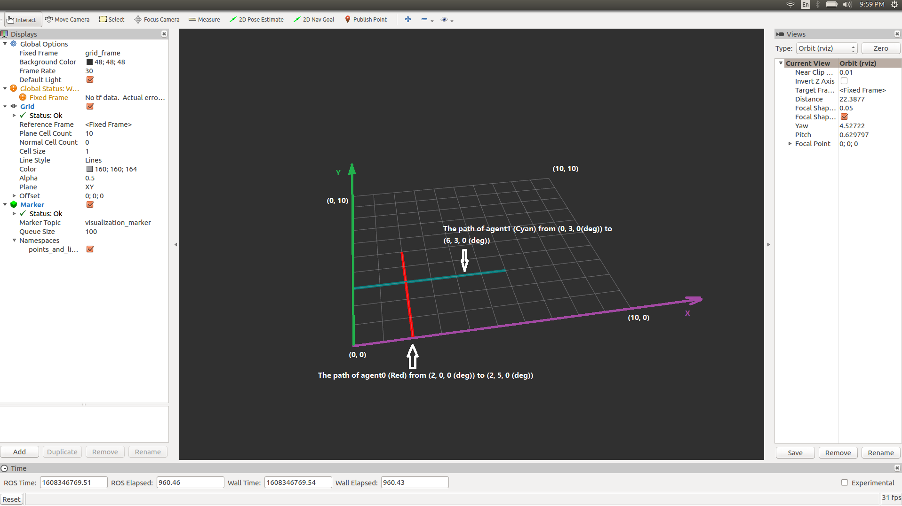
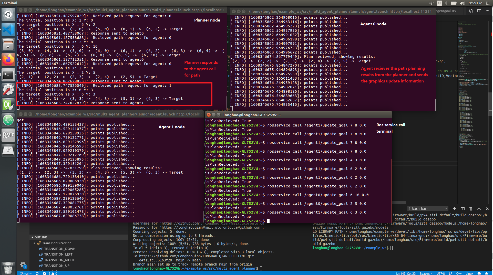

# Multi-agent Planning

 

This is the ros package to implement multi-agent planning function. The agent node simulates the agent logic by requesting the path via the rosservice from the planner node. The planner node processes the service call and sents out the path to the corresponding agent. 

## Download and compile:

- The same as the download and compiling process of a regular ros package.

> $ cd catkin_ws/src

> $ git clone https://github.com/LonghaoQian/LONGHAO_QIAN_FULLTIME

> $ cd ../..

> $ catkin_make

## How to run the ros nodes:

The launch files of this package is listed in the following table:

|        Name    | Function                       |
|----------------|-------------------------------|
|`'multi_planner.launch'` | To launch the planner node           |
|`'agent.launch'`          |To launch the agent node          |

- Start the planner (new terminal)

> $ roslaunch multi_agent_planner multi_planner.launch 

- Start agent 0 and 1 (The agent 0 and 1 correspond to " agent_1 " and "agent_2" in the project description, respectively ) (2 new terminals)

> $ roslaunch multi_agent_planner agent.launch "agentID:=agent0"

> $ roslaunch multi_agent_planner agent.launch "agentID:=agent1"

- Start the rviz (new terminal)

> $ rosrun rviz rviz

Two rosnodes are created with the corresponding agent IDs. 

- How to make the `'rosservice call'`

In order to distinguish the service topics, a prefix is added to "/update_goal" topic. The service calls to agents in the test case are:

> $ rosservice call /agent0/update_goal 2 5 0.0

> $ rosservice call /agent1/update_goal 6 3 0.0

- Settings for rviz

> `'Fixed Frame'` is set to "grid_frame"

> `'Marker Topic'` is visualization_marker

- Parameter settings:

Parameter files are listed in the following table:

|        Name    | Function                       |
|----------------|-------------------------------|
|`'plannersetting.yaml'` | To set the number of agents supported by the planner           |
|`'agent0para.yaml'`          |To set the initial position of agent0          |
|`'agent1para.yaml'`          |To set the initial position of agent1          |

## The planning algorithm

- Heuristic algorithm

Since the gird given in the problem statement is uniform in term of node and edge costs, the path can be directly calculated by the grid distance. Once the start position and the target position are determined, the path is given by the euler distance in the x and y directions. The function for this method is `'HeuristicPlanning '` in planner.cpp. 

- Algorithms for complicated scenarios

If complicated scenarios are requested, such as obstacles, collisions, and varying edge costs, a list of potential methods are suggested:

> A* algorithm

> Swarming algorithms

> Machine learning related methods

## Sample results

- Here are the sample results. The paths are shown in the first picture. The path of agent 0 is shown in the red line. The path of agent1 is shown in cyan line. 

- The terminals are shown in the picture. When a rossevice call is made to the "/update_goal" topic, the planner displays the path results and sends it back to the corresponding agent. The agent displays the path from the planner again and updates the graphics in rviz. 

## Discussions

- About simulating the movement of the agent:

For the 4th point of "Create an agent node: (20 points) ". The agent is assumed to move uniformly with a period of 10s based on the first sentence. However, the next sentence says " You are not required to simulate the motion of the agent". I am not sure whether the movements should be simulated. If they are to be simulated, the starting time of the motion (whether the motion of an agent starts right after the path is revceived), the stop logic (whether the agent stops at the end of the path), and the collision physics are not stated clearly, so I am not sure how to proceed with this step.

If the motion is required, I could add a moving effect (constant velocity of 0.1m/s) to each agent. 

